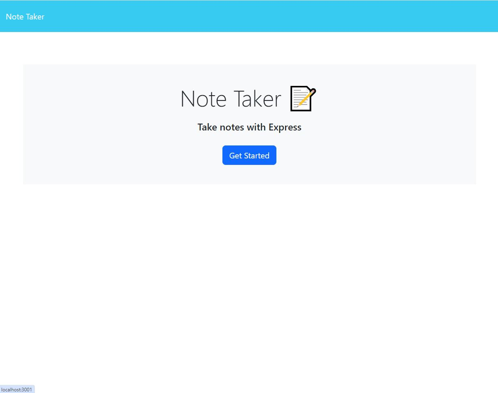
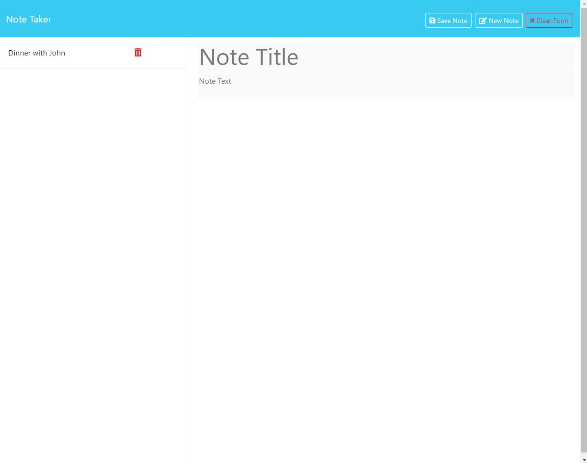
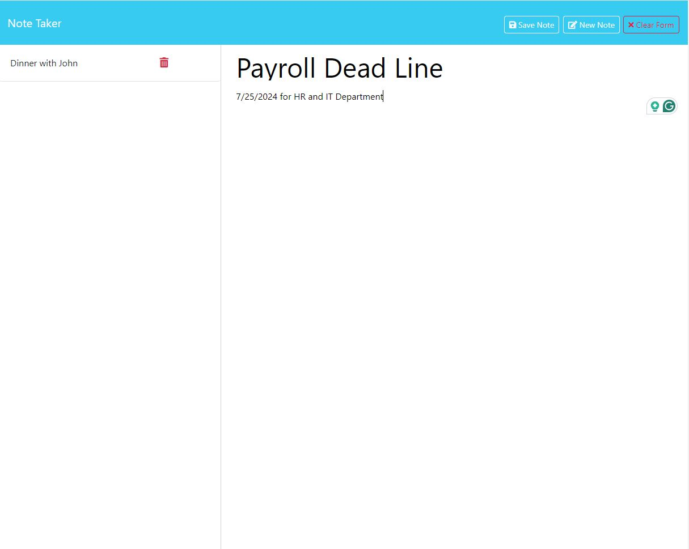
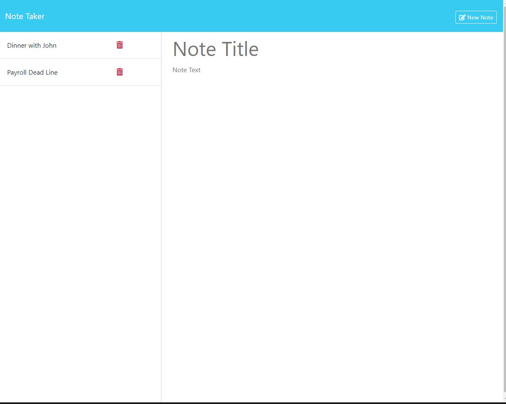

Note Taker App Overview

Github Link:

https://github.com/sagagi74/Note-Taker

Heroku Link:

https://yongnotetaker-ab90ca7e5351.herokuapp.com/

The Note Taker app is a simple web application that allows users to create, view, and delete notes. It leverages front-end and back-end technologies to provide a seamless user experience for note management. The application is built using JavaScript, HTML, CSS, and Node.js with Express.js.Node.js is used as the runtime environment to execute JavaScript on the server side and express is a web application framework for Node.js that simplifies the creation of server-side applications.

Funtionality 

GIVEN a note-taking application, WHEN I open the Note Taker, THEN I am presented with a landing page featuring a link to a notes page.

WHEN I click on the link to the notes page, THEN I am directed to a page displaying existing notes in the left-hand column and empty fields to enter a new note title and the note’s text in the right-hand column.

!Unless you click on "New Note", note title and note's text are disabled! , once you click on "New Note" then, I can enter a new note title and the note’s text, THEN a "Save Note" button and a "Clear Form" button appear in the navigation bar at the top of the page.

WHEN I click on the "Save Note" button, THEN the new note I have entered is saved, appears in the left-hand column with the other existing notes, and the buttons in the navigation bar disappear.

WHEN I click on an existing note in the list in the left-hand column, THEN that note appears in the right-hand column and a "New Note" button appears in the navigation bar.

WHEN I click on the "New Note" button in the navigation bar at the top of the page, THEN I am presented with empty fields to enter a new note title and the note’s text in the right-hand column, and the "New Note" button disappears.

If both title and text are empty, you can not save the notes. both fields can not have null values.

Home Screen

Show Previous Save Notes

Adding New Notes

Saving notes

Deleting 

